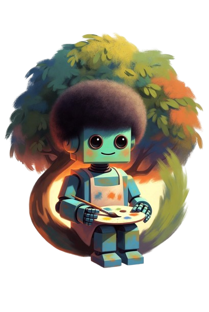

<p align="center">
  
</p>

# svg.bot

**The most accurate image → fontless SVG converter available!** Not by picking one tracer and hoping for the best, but by running multiple vectorization engines in parallel, scoring every candidate with perceptual metrics, and iteratively **diffing, patching, and merging** corrective paths until fidelity plateaus.

SvgBot combines **StarVector** (neural im2svg, GPU), **VTracer** (classical color tracing), **DinoScore** / **LPIPS** candidate ranking, and a **residual-overlay refinement loop** on every conversion that surgically fixes whatever the base engine missed. Optional **MPP / x402** payments let autonomous agents pay per conversion.

---

## How it works

SvgBot treats vectorization as a **search-and-refine** problem, not a single pass through one algorithm.

### Phase 1: Preprocess & classify

The input image is loaded, resized (long edge capped at 2048 px), and analyzed for **unique color count** and **edge density**. That classifies it as `logo`, `illustration`, or `photo`, which selects VTracer parameter grids and which downstream candidates run.

A second classifier, **`is_monochrome_logo`**, bucket-counts the image into 64 coarse RGB bins and asks whether the top 2 bins cover >=92% of pixels. This catches **monochrome brand marks whose anti-aliasing pushes `unique_colors` above the logo threshold** (the cleo regression: 64 unique colors after AA, but truly 2 tones underneath). When it fires, the orchestrator **promotes the effective kind to `logo`** so the logo-only routing below applies regardless of what the color/edge classifier said.

### Phase 2: Multi-engine candidate generation

The default engine is **`auto`**: SvgBot runs every applicable engine, scores them, picks a winner, and refines. Pick a single engine when you know what fits:

| Engine | Best for | What it does |
|--------|----------|--------------|
| **Auto** | Maximum accuracy | Runs every applicable engine below; ranks them with a kind-aware metric (see Phase 3). Default. |
| **StarVector** | Illustrations, complex artwork | A vision-language model (`starvector-1b-im2svg` or `8b`) generates SVG path markup directly from the image. Runs `k` stochastic samples (3 standard / 5 high quality); each sample is rasterized and scored, then a **best-of-k** is chosen with a DinoScore primary + LPIPS tiebreak (`_LPIPS_TIEBREAK_DINO_EPS = 0.02`). Needs a CUDA GPU. |
| **VTracer** | Photos, gradients, many colors | Classical color-region tracing on the raw image. **Auto-tune** sweeps a parameter grid (`LOGO_GRID` for logos, `DEFAULT_GRID` otherwise) and keeps the highest-scoring result. |
| **VTracer smooth** | Logos, icons, brand marks | Bilateral filter + k-means palette quantization (`clean_for_tracing`) produces flat color regions with crisp edges, then VTracer traces with a **smooth-curve grid** (`LOGO_SMOOTH_GRID`) tuned for fewer control points and cleaner splines. Skipped for photos. Still scored against the **original** image. |
| **VTracer mono** | 2-color logos (cleo, wordmarks) | **Forces a 2-color palette** before tracing, collapsing every anti-aliased shade of the foreground into a single fill. Uses `LOGO_MONO_GRID` (binary colormode, low filter_speckle) so the output is a handful of clean paths instead of one micro-path per AA pixel. Skipped for non-logos. |

**Inside Auto**, the candidate set is:

| Candidate | When it runs |
|-----------|--------------|
| **StarVector** | Whenever CUDA is available; skipped silently otherwise. |
| **VTracer** | Always. |
| **VTracer smooth** | Whenever `kind != "photo"` and `VTRACER_SMOOTH_ENABLED=true` (default). |
| **VTracer mono** | Whenever the effective kind is `logo` (including monochrome-promoted illustrations). |

Each candidate is rasterized back to pixels and scored with:

- **DinoScore**: ResNet-50 embedding cosine similarity between original and rendered SVG (higher = better global match).
- **LPIPS**: AlexNet perceptual similarity (higher = better local crispness, e.g. letterforms).

### Phase 3: Kind-aware ranking and selection

The winner is chosen with a **kind-aware** rank function (`orchestrator._pick_best_candidate`):

| Effective kind | Rank metric | Why |
|----------------|-------------|-----|
| `logo` (including monochrome-promoted) | `mean(dino, lpips)` | DinoScore alone over-weights global color match. On letterforms, two candidates can have near-identical DinoScores but very different glyph crispness; LPIPS catches that. Mean-ranking is what fixed the cleo regression. |
| `illustration`, `photo` | `dino` | LPIPS over-rewards pixel-perfect edge fidelity, which is the wrong signal for photographic or illustrative content. |

The winner becomes the **base SVG** for refinement. The full per-engine score breakdown (`engine`, `dino`, `lpips`, `mean`, `selected`, `tried`) is returned on the job result so the UI can show **exactly which engine won and by how much**.

### Phase 4: Iterative residual diff, vectorize, merge

Every conversion runs refinement. Even the best single-pass SVG leaves pixels that don't match the source: missing letter counters, softened corners, anti-aliasing gaps, small color patches. SvgBot closes that gap with a bounded refinement loop whose cap depends on the **Quality tier**:

| Quality | Refine pass cap | StarVector samples (`k`) |
|---------|-----------------|--------------------------|
| `standard` (default) | **8** | 3 |
| `high` | `REFINE_MAX_PASSES` (default **20**) | 5 |

`high` runs more StarVector candidates and lets the refinement loop work longer, at the cost of latency.

Each pass:

1. **Rasterize** the current best SVG back to a bitmap at the source dimensions.
2. **Pixel diff**: compute per-pixel RGB absolute difference between the original and the render. Pixels above a threshold (default 12, scaled per variant) form a boolean **residual mask**.
3. **Mask filtering**: two filters suppress false positives:
   - **Edge exclusion**: Canny edges of the rendered SVG are dilated and removed from the mask. Anti-aliasing halos along every shape boundary would otherwise dominate the diff; real defects (malformed counters, missing dots) are interior regions that survive.
   - **Connected-component filtering**: blobs below a minimum area (8-48 px depending on variant) are dropped as speckle noise.
4. **Extract residual**: original pixels where the mask is true are copied into an RGBA image; everything else is transparent.
5. **Vectorize residual**: only the differing pixels are traced with VTracer using the current pass variant's parameters (`colormode`, `hierarchical`, `mode`, `filter_speckle`, `path_precision`, `color_precision`).
6. **Merge overlay**: the corrective SVG paths are appended to the base SVG inside a `<g class="vb-refine">` group. If the base and overlay use different `viewBox` coordinate systems (common when StarVector emits normalized `0 0 1 1` units and VTracer uses pixel units), a **`transform="matrix(...)"`** maps overlay coordinates into the base canvas.
7. **Re-score**: the merged SVG is rasterized and DinoScored against the original.
8. **Accept or reject**: if DinoScore improved by at least `REFINE_MIN_DELTA` (default 0.0005), the merge is kept and becomes the new best SVG. Otherwise the pass counts as a failure.

**Six pass variants** cycle (`pass_idx % 6`), progressing from conservative (large interior defects, high `min_component_area`) to aggressive (fine near-edge defects, binary colormode, zero edge exclusion):

| Variant | Threshold factor | Edge exclusion | Min area | VTracer mode |
|---------|-----------------|----------------|----------|--------------|
| 1 | 0.7× | 2 px | 48 px | color / stacked / spline |
| 2 | 1.0× | 2 px | 32 px | color / stacked / spline |
| 3 | 0.8× | 1 px | 24 px | color / cutout / spline |
| 4 | 0.65× | 1 px | 16 px | color / stacked / polygon |
| 5 | 0.5× | 1 px | 12 px | color / stacked / spline |
| 6 | 0.4× | 0 px | 8 px | binary / stacked / spline |

The loop stops when:

- All six variants produce masks below `REFINE_MIN_MASK_RATIO` (0.05% of pixels): nothing left to fix.
- Three consecutive passes fail to improve the score (diminishing returns).
- `REFINE_MAX_PASSES` is reached.

Accepted passes are counted in the API response as `refine_passes`; peak residual coverage as `refine_coverage`.

### Phase 5: Fontless sanitize

If `fontless=true` (default), `<text>` elements and font references are stripped or converted to paths so the output is pure geometry: no embedded fonts, no system-font dependencies.

### Live progress and per-engine score reporting

While a job runs, the orchestrator emits a progress message **after each engine finishes** that names the engine and its scores, e.g.:

```
[preprocessing ] Detected: logo (64 unique colors, edge_density=0.023, monochrome)
[starvector    ] StarVector: dino=0.951 lpips=0.962 mean=0.957
[vtracer       ] VTracer: dino=0.929 lpips=0.987 mean=0.958
[vtracer_smooth] VTracer smooth: dino=0.930 lpips=0.987 mean=0.959
[vtracer_mono  ] VTracer monochrome: dino=0.947 lpips=0.991 mean=0.969
[refining      ] Winner: vtracer_mono (mean(dino,lpips)=0.969) out of 4 engine(s)
[refining      ] Refinement accepted 3 pass(es), final dino=0.953 lpips=0.992
[sanitizing    ] Cleaning up SVG
```

The frontend stepper keeps each message visible on its corresponding step (not just the live phase), so by the time the job finishes you can read the entire decision trail in place.

The job result also carries two structured fields the UI renders below the metrics:

- `metrics.decision`: a one-line summary, e.g. `Winner: vtracer_mono (mean(dino,lpips)=0.969) out of 4 engine(s)`.
- `metrics.candidate_scores`: a list of `{engine, dino, lpips, mean, selected, tried}` rows, one per engine that ran. The UI shows them in a collapsible **Per-engine scores** table with the winner highlighted.

---

## Quick start

The simplest way to run SvgBot is from the project root:

```bash
bash run.sh
```

That creates `backend/.venv` if needed, installs Python and npm dependencies (including StarVector), starts the FastAPI backend on port 8000 and the Vite frontend on port 5173, then opens both services. Press `Ctrl+C` to stop.

Open **http://127.0.0.1:5173** in your browser.

### Convert an image

The web UI accepts input two ways:

- **Upload**: drag and drop a file or click to browse (PNG, JPG, WebP, GIF, and other common formats).
- **From URL**: paste a direct link to a publicly reachable image; the backend downloads it server-side before vectorizing.

Choose quality and engine options, then run the conversion. The progress panel reports each engine's DinoScore / LPIPS / mean as it finishes and prints a one-line `Winner: ...` summary before refinement starts. After completion, the result panel shows a collapsible **Per-engine scores** table so you can see exactly which engine won and by how much. The result SVG can be previewed and downloaded when the job finishes.

Override ports with environment variables:

```bash
BACKEND_PORT=8080 FRONTEND_PORT=3000 bash run.sh
```

### macOS (Terminal)

```bash
git clone https://github.com/jamesmudgett/SvgBot.git
cd SvgBot
chmod +x run.sh
bash run.sh
```

Requires **Python 3.11+**, **Node.js 18+**, and an **NVIDIA GPU with CUDA** for StarVector (see [GPU requirements](#gpu-requirements) below). macOS without CUDA falls back to VTracer-only if StarVector cannot load.

### Windows

| Shell | Command |
|-------|---------|
| **PowerShell** (recommended) | `.\run.ps1` |
| **CMD** | `run.cmd` |
| **Git Bash / WSL** | `bash run.sh` |

```powershell
git clone https://github.com/jamesmudgett/SvgBot.git
cd SvgBot
.\run.ps1
```

Do **not** run `./run.ps1` in Git Bash — `.ps1` files are PowerShell scripts. Use `bash run.sh` in Git Bash instead.

Native Cairo/GTK is **not** required on Windows; SvgBot patches StarVector to rasterize via `svglib` when Cairo is missing.

### Linux

```bash
git clone https://github.com/jamesmudgett/SvgBot.git
cd SvgBot
chmod +x run.sh
bash run.sh
```

Same prerequisites as macOS. For GPU support, install [CUDA-enabled PyTorch](#cuda-pytorch-required-for-gpu) after the first run.

---

## GPU requirements

StarVector (the neural engine) requires an **NVIDIA GPU with CUDA**. CPU-only PyTorch will load but StarVector reports `CUDA not available` and the orchestrator falls back to VTracer.

| Model | VRAM | Env var |
|-------|------|---------|
| `starvector/starvector-1b-im2svg` (default) | ~8 GB | `STARVECTOR_MODEL=starvector/starvector-1b-im2svg` |
| `starvector/starvector-8b-im2svg` | ~16 GB | `STARVECTOR_MODEL=starvector/starvector-8b-im2svg` |

**VTracer**, **DinoScore**, and the **refinement loop** run on CPU and do not need a GPU. Set `STARVECTOR_ENABLED=false` in `backend/.env` for a fully CPU-only deployment.

StarVector works best on **icons, logos, diagrams, and charts** — not arbitrary photographs.

Verify your setup:

```bash
cd backend
PYTHONPATH=. python scripts/check_starvector.py
```

Then confirm `http://127.0.0.1:8000/health` includes `"api_version": "0.1.1"` and a `starvector_config` block with `"ready": true`.

---

## Detailed setup

### Stack

- **Backend**: FastAPI, StarVector (transformers), VTracer, DinoScore/LPIPS metrics
- **Frontend**: React + Vite
- **Payments**: [MPP](https://mpp.dev) (Tempo/Stripe) and [x402](https://docs.x402.org) HTTP 402

### Backend (manual)

```bash
cd backend
python -m venv .venv
source .venv/bin/activate          # macOS / Linux
# .venv\Scripts\activate           # Windows
pip install -r requirements.txt
cp .env.example .env               # copy .env.example .env  on Windows
uvicorn app.main:app --reload --reload-dir app --reload-exclude '*.pyc' --reload-exclude '.venv/*' --host 0.0.0.0 --port 8000
```

### Frontend (manual)

```bash
cd frontend
npm install
npm run dev
```

Open http://localhost:5173

### CUDA PyTorch (required for GPU)

Default `pip install torch` is often **CPU-only**. With an NVIDIA GPU:

```bash
pip install -r backend/requirements-gpu.txt
```

### StarVector package

StarVector requires **transformers 4.49** (5.x causes meta-device load failures). Install deps first (includes flexible **torch≥2.6** wheels), then the git package **without** its upstream metadata deps — upstream pins `torch==2.5.1`, which is often missing from PyPI on newer Python.

```bash
pip install -r backend/requirements-starvector-deps.txt
pip install --no-deps -r backend/requirements-starvector-package.txt
```

`bash run.sh` does both steps automatically. Optional upstream extras such as **`flash_attn`** are not pulled in (SvgBot defaults to **`STARVECTOR_ATTN_IMPLEMENTATION=eager`**); install `flash_attn` yourself only if you switch attention modes and your platform supports builds.

Configure in `backend/.env`:

```env
STARVECTOR_ENABLED=true
STARVECTOR_MODEL=starvector/starvector-1b-im2svg
HF_TOKEN=hf_...   # recommended for faster Hugging Face downloads
```

Refinement tuning (optional; refinement always runs unless `REFINE_MAX_PASSES=0`):

```env
REFINE_MAX_PASSES=20
REFINE_MIN_DELTA=0.0005
REFINE_RESIDUAL_THRESHOLD=12
REFINE_MIN_MASK_RATIO=0.0005
```

### Tests

```bash
cd backend
pytest -q
```

Use `engine=vtracer` in tests when GPU / StarVector is unavailable.

---

## Deploy

Two supported paths to DigitalOcean. Pick based on whether you want StarVector (needs a GPU) or are happy with VTracer plus the refinement loop (CPU-only, much cheaper).

| Path | StarVector | Where it runs | Approx. cost |
|------|------------|---------------|--------------|
| **A. App Platform (CPU-only, default)** | Disabled | One App with `static_sites: web` + `services: api` | ~$12/mo (one `basic-xs` service; static site is free) |
| **B. GPU Droplet + App Platform frontend** | Enabled | Backend on a GPU Droplet, frontend as a static site | $300+/mo (e.g. RTX 4000 Ada GPU Droplet) |

Both paths use specs committed under `.do/`. Install [`doctl`](https://docs.digitalocean.com/reference/doctl/how-to/install/) and run `doctl auth init` first. Edit `github.repo` in the spec to point at your fork if you're not deploying upstream.

### A. CPU-only on DigitalOcean App Platform (default)

The spec at `.do/app.yaml` defines a single App with two components:

- `static_sites: web` builds `frontend/` with the Node buildpack and serves the SPA from the CDN (free).
- `services: api` builds `backend/Dockerfile` (CPU-only image; no CUDA, no StarVector) and runs FastAPI on port 8000.
- Ingress routes `/api`, `/health`, and `/.well-known` to the API service. Everything else falls through to the static site, so the frontend hits the API with relative `/api/...` URLs and no CORS configuration is needed.

Without StarVector the orchestrator runs VTracer + VTracer-smooth + VTracer-mono and the residual refinement loop. Quality stays high on logos, icons, and most illustrations; you only lose the neural im2svg candidate.

Deploy:

```bash
# Optional: validate the spec before pushing.
doctl apps spec validate .do/app.yaml

# First deploy.
doctl apps create --spec .do/app.yaml

# Subsequent deploys happen automatically on push to main (deploy_on_push: true).
# To redeploy manually:
doctl apps update <app-id> --spec .do/app.yaml
```

The image never ships your local secrets: `backend/.dockerignore` excludes `.env`, `.venv/`, `data/`, and the StarVector requirement files. Set runtime values in the App Platform dashboard (or via `doctl apps update`):

| Env var | Purpose | Recommended setting |
|---------|---------|--------------------|
| `HF_TOKEN` | Faster Hugging Face downloads, higher rate limits | Scope `RUN_TIME`, type `SECRET` |
| `XAI_API_KEY` | Enables the Grok-powered editor chat panel | Scope `RUN_TIME`, type `SECRET` |
| `PAYMENTS_ENABLED=true` plus `MPP_*` / `X402_*` | Agent API payments ($0.50/conversion) | Scope `RUN_TIME` |

The `api` service runs on `basic-xs` (1 vCPU / 1 GB RAM). DinoScore (ResNet-50, ~100 MB) and LPIPS (AlexNet, ~50 MB) load lazily on the first request, so the first conversion takes 30-60s while models warm up. Bump `instance_size_slug` in `.do/app.yaml` if you need more concurrency or hit OOMs.

### B. GPU Droplet for the backend + App Platform for the frontend

Use this when you want StarVector. The backend runs on a GPU you control (DigitalOcean GPU Droplet, your own box, anywhere with NVIDIA drivers); the static frontend stays on App Platform and calls the backend over HTTPS.

#### 1. Provision the GPU Droplet

Any image with an NVIDIA GPU works. The example uses Ubuntu 22.04.

```bash
# After SSHing into the Droplet:
sudo apt-get update && sudo apt-get install -y docker.io docker-compose-plugin

# Install NVIDIA Container Toolkit so `docker --gpus all` works.
distribution=$(. /etc/os-release; echo $ID$VERSION_ID)
curl -fsSL https://nvidia.github.io/libnvidia-container/gpgkey | \
  sudo gpg --dearmor -o /usr/share/keyrings/nvidia-container-toolkit-keyring.gpg
curl -s -L https://nvidia.github.io/libnvidia-container/$distribution/libnvidia-container.list | \
  sed 's#deb https://#deb [signed-by=/usr/share/keyrings/nvidia-container-toolkit-keyring.gpg] https://#g' | \
  sudo tee /etc/apt/sources.list.d/nvidia-container-toolkit.list
sudo apt-get update && sudo apt-get install -y nvidia-container-toolkit
sudo nvidia-ctk runtime configure --runtime=docker
sudo systemctl restart docker

# Sanity check.
sudo docker run --rm --gpus all nvidia/cuda:12.4.1-base-ubuntu22.04 nvidia-smi
```

#### 2. Run the backend on the Droplet

```bash
git clone https://github.com/jamesmudgett/SvgBot.git
cd SvgBot
cp backend/.env.example backend/.env
# Edit backend/.env:
#   STARVECTOR_ENABLED=true
#   HF_TOKEN=hf_...
#   CORS_ORIGINS=https://<your-app-platform-frontend-url>
sudo docker compose up -d --build api
```

Only the `api` service is started: App Platform serves the frontend, so the `web` container in `docker-compose.yml` isn't needed on the Droplet.

#### 3. Put HTTPS in front of port 8000

Browsers refuse to load mixed-content HTTP backends from an HTTPS App Platform origin. Caddy with automatic Let's Encrypt is the lowest-friction option:

```bash
sudo apt-get install -y caddy
sudo tee /etc/caddy/Caddyfile > /dev/null <<'CADDY'
api.your-domain.com {
  reverse_proxy localhost:8000
}
CADDY
sudo systemctl restart caddy
```

Point an A record for `api.your-domain.com` at the Droplet's public IP and wait for the cert to issue.

#### 4. Deploy the App Platform frontend

```bash
# Edit .do/app.gpu-droplet.yaml:
#   set VITE_API_BASE to https://api.your-domain.com
doctl apps create --spec .do/app.gpu-droplet.yaml
```

`VITE_API_BASE` is scoped `BUILD_TIME` because Vite inlines `import.meta.env.*` at build. Changing it later requires a fresh deploy (`doctl apps update <app-id> --spec ...`).

### Local Docker Compose (no DigitalOcean)

For local end-to-end testing of the GPU stack:

```bash
docker compose up --build
# Frontend: http://localhost:5173, API: http://localhost:8000
```

`docker-compose.yml` uses the CUDA backend image. To run the CPU stack locally instead, edit the `api` service in `docker-compose.yml` to `dockerfile: Dockerfile` (the CPU image at `backend/Dockerfile`) and remove the `deploy.resources` GPU reservation.

---

## Agent API (MPP / x402)

**$0.50 per conversion** when payments are enabled. Full instructions: [docs/AGENT_API.md](docs/AGENT_API.md).

| Discovery | Description |
|-----------|-------------|
| `GET /.well-known/agent-api` | Machine-readable workflow, pricing, MPP/x402 steps |
| `GET /.well-known/mpp-discovery` | MPP discovery document |

Enable in `backend/.env`:

```env
PAYMENTS_ENABLED=true
PRICE_PER_CONVERSION_USD=0.50
MPP_SECRET_KEY=sk_...
MPP_TEMPO_RECIPIENT=0x...
MPP_TEMPO_CURRENCY=0x20c0000000000000000000000000000000000000
X402_ENABLED=true
X402_EVM_ADDRESS=0x...
```

```bash
pip install -r backend/requirements-payments.txt
```

Paid flow: pay on `POST /api/vectorize` → `{ "job_id" }` → poll `GET /api/jobs/{id}` → `GET /api/jobs/{id}/svg`.

---

## API

| Method | Path | Description |
|--------|------|-------------|
| POST | `/api/vectorize` | Start conversion (multipart: `file` **or** `image_url`, plus `quality`, `engine`, `fontless`). `engine` is one of `auto`, `starvector`, `vtracer`, `vtracer_smooth`, `vtracer_mono`. |
| GET | `/api/jobs/{id}` | Job status + result. `metrics` includes `dino_score`, `lpips`, `engine`, `candidates_tried`, `path_count`, `ms`, `base_dino_score`, `refine_passes`, `refine_coverage`, `decision` (winner summary), and `candidate_scores` (per-engine breakdown). |
| GET | `/api/jobs/{id}/svg` | Download SVG |
| GET | `/.well-known/agent-api` | Agent API instructions (JSON) |
| GET | `/.well-known/mpp-discovery` | MPP payment discovery ($0.50/conversion) |
| GET | `/health` | Health + StarVector availability |

---

## Troubleshooting

### "Failed to fetch" in the UI

The browser could not reach the API. Usually the backend is not running.

1. Start both services: `bash run.sh` or `.\run.ps1` on Windows.
2. Confirm the API responds: open http://127.0.0.1:8000/health — you should see `{"status":"ok",...}`.
3. Use the Vite dev server at http://127.0.0.1:5173 (`npm run dev`), not a static file or build opened without the proxy.
4. If you set `VITE_API_BASE` in `frontend/.env`, point it at a reachable host (e.g. `http://127.0.0.1:8000`). Leave it unset for the default dev proxy.

The UI shows a red banner when `/health` is unreachable.

### "StarVector disabled via STARVECTOR_ENABLED=false"

That exact text is from an **old backend build**. Restart after pulling latest code. If `starvector_config.starvector_enabled` is `true` but `starvector` is `false`, check `starvector_detail.reason` — usually **CPU-only PyTorch** (`CUDA not available`) even when an NVIDIA GPU is present; install `requirements-gpu.txt`.

### "Failed to import transformers… [WinError 6714]" on Windows

The cause is `uvicorn --reload` watching directories it shouldn't (the venv, the StarVector/HF model cache). A model download or `.pyc` regeneration triggers a worker reload mid-import; the new worker tries to re-import `transformers` while the old one still holds file handles, and Windows returns `[WinError 6714]`.

The shipped `run.ps1` / `run.sh` already pass `--reload-dir app --reload-exclude '*.pyc' --reload-exclude '.venv/*'`, so reloads only fire on application code changes. If you still hit this (e.g. running uvicorn manually), restart in a fresh PowerShell window:

```powershell
Get-Process | Where-Object { $_.Path -like '*\backend\.venv\*' } | Stop-Process -Force
.\run.ps1
```

If you need to launch uvicorn directly, mirror the reload scope:

```powershell
cd backend
.\.venv\Scripts\python -m uvicorn app.main:app `
  --reload --reload-dir app --reload-exclude '*.pyc' --reload-exclude '.venv/*' `
  --host 0.0.0.0 --port 8000
```

---

## License

GPL-3.0 — see [LICENSE](LICENSE).
